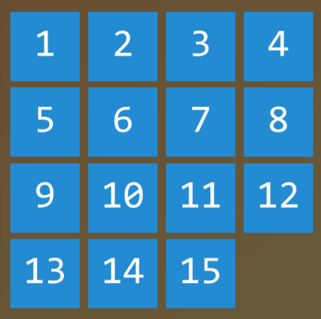
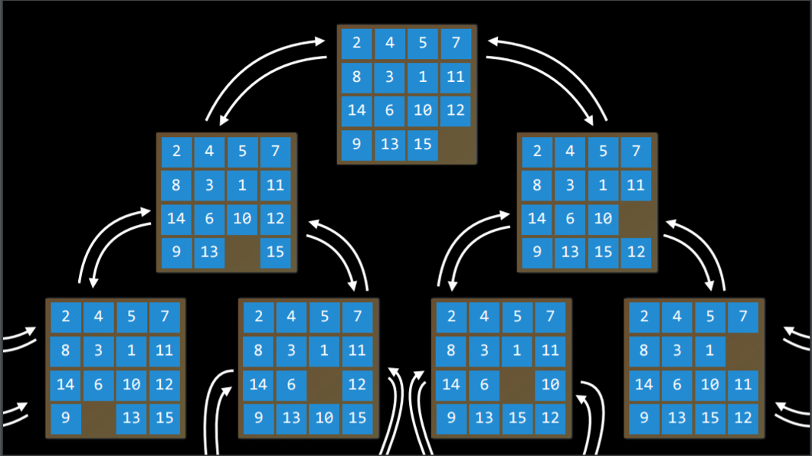

# SEARCH

> Search problems involve an agent that is given an initial state and a goal state, and it returns a solution of how to get from the former to the latter. A navigator app uses a typical search process, where the agent (the thinking part of the program) receives as input your current location and your desired destination, and, based on a search algorithm, returns a suggested path.

## TERMS

- [ ] Agent

  An entity that perceives its environment and acts upon that environment.					

- [ ] State

  - A configuration of an agent in its environment.

- [ ] Actions

  - Choices that can be made in a state. More precisely, actions can be defined as a function. Upon receiving state `s` as input, `Actions(s)` returns as output the set of actions that can be executed in state `s` .

- [ ] Transition Model

  - A description of what state results from performing any applicable action in any state. More precisely, the transition model can be defined as a function. Upon receiving state `s` and action `a` as input, `Results(s,a)` returns the state resulting from performing action `a` in state `s`.

- [ ] State Space

  - The set of all states reachable from the initial state by any sequence of actions.

  

- [ ] Goal Test

  - The condition that determines whether a given state is a goal state.

- [ ] Path Cost

  - A numerical cost associated with a given path.

- [ ] Solution
  - A sequence of actions that leads from the initial state to the goal state.
- [ ] Optimal Solution
  - A solution that has the lowest path cost among all solutions.

## Solving Search Problems

In a search process, data is often stored in a **node**, a data structure that contains the following data:

- A state
- Its *parent node*, through which the current node was generated
- The *action* that was applied to the state of the parent to get to the current node
- The *path cost* from the initial state to this node

To actually search, we use the **frontier**, the mechanism that "manages" the nodes. The *frontier* starts by containing an initial state and an empty set of explored items, and then repeats the following actions until a solution is reached:

Repeat:

1. If the frontier is empty,
   - STOP. There is no solution to the problem.
2. Remove a node from the frontier. This is the node that will be considered.
3. If the node contains the goal state,
   - Return the solution. STOP

Else,

```
* Expand the node (find all the new nodes that could be reached from this node), and add resulting nodes to the frontier
* Add the current node to the explored set.
```

**Depth-First Search**

In the previous description of the *frontier*, one thing went unmentioned. Which node should be removed? This choice has implications on the quality of the solution and how fast it is achieved. There are multiple ways, two of which can be represented by the data structures of **stack**(in depth-first search) and **queue**(breadth-first search)

A *depth-first* search algorithm exhausts each one direction before trying another direction. In these cases, the frontier is managed as a *stack* data structure. "*Last-in first-out*". This results in a search algorithm that goes as deep as possible in the first direction that gets in its way while leaving all other directions for later.

- Pros:
  - At best, this algorithm is the fastest. If we are lucky and it always chooses the right path to the solution, then it takes the least possible time to get to a solution.
- Cons:
  - It is possible that the found solution is not optimal.
  - At worst, this algorithm will explore every possible path before finding the solution, thus taking the longest possible time before reaching the solution.

Code example:

```python
# Define the function that removes a node from the frontier and returns it.
def remove(self):
    #T Terminate the search if the frontier is empty, because this means that there is no solution.
    if self.empty():
        raise Exception("empty frontier")
    else:
       	# Save the last item in the list (which is the newest node added)
        node = self.frontier[-1]
        # Save all the items on the list besides the last node (i.e removing the last node)
        self.frontier = self.frontier[:-1]
        return node
```

**Breadth-First Search**

The opposite of depth-first search would be breath-first search.

A *breadth-first* search algorithm will follow multiple directions at the same time, taking one step in each possible direction before taking the second step in each direction. In this case, the frontier is managed as a *queue* data structure. "*first-in first-out*".

- Pros:
  - this algorithm is guaranteed to find the optimal solution.
- Cons:
  - This algorithm is almost guaranteed to take longer than the minimal time to run.
  - At worst, this algorithm takes the longest possible time to run.

Code example:

```python
# Define the function that removes a node from the frontier and returns it.
    def remove(self):
    	  # Terminate the search if the frontier is empty, because this means that there is no solution.
        if self.empty():
            raise Exception("empty frontier")
        else:
            # Save the oldest item on the list (which was the first one to be added)
            node = self.frontier[0]
            # Save all the items on the list besides the first one (i.e. removing the first node)
            self.frontier = self.frontier[1:]
            return node
```

**Greedy Best-First Search**

Breadth-first and depth-first are both **uninformed** search algorithms, meaning that these algorithms do not utilize any knowledge about the problem that they did not acquire through their own exploration. A type of algorithm that considers additional knowledge to try to improve its performance is called an **informed** search algorithm.

**Greedy best-first** search expands the node that is the closest to the goal, as determined by a **heuristic function** *h(n)*.
